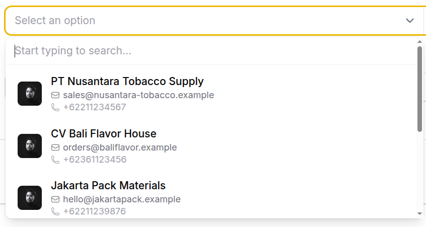
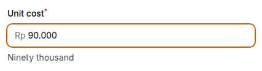
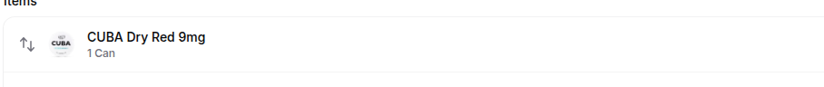
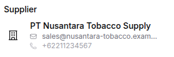
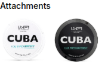
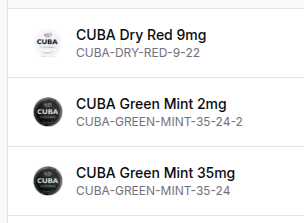
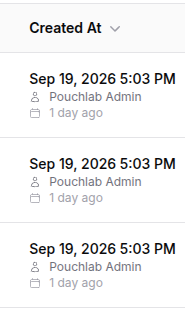
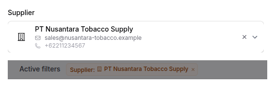

# Fiddy

[](https://github.com/bensondevs/fiddy/actions/workflows/tests.yml)
[](https://opensource.org/licenses/MIT)

**F**ilament **I**nteractive and **D**escriptive **D**isplay — rich Image, Title, and Description components for Filament 5.

Fiddy layers presentation (avatar, title, description, hint, icons) on top of familiar Filament forms, infolists, tables, and filters — with one shared `Content` / `Option` model and a single presenter for everything.


## Table of contents

- [Installation](#installation)
- [Forms](#forms)
  - [Select](#select)
  - [Numeric input](#numeric-input)
- [Infolists](#infolists)
  - [Entry](#entry)
  - [Image entry](#image-entry)
  - [Timestamp entry](#timestamp-entry)
- [Tables](#tables)
  - [Column](#column)
  - [Timestamp column](#timestamp-column)
- [Filters](#filters)
  - [Select filter](#select-filter)
- [Presentation](#presentation)
  - [On the model](#on-the-model)
  - [No presenter, no contract](#no-presenter-no-contract)
  - [Separate presenter](#separate-presenter)
  - [Resolution order](#resolution-order)
- [License](#license)

## Installation

Requires Filament `^5` and PHP `^8.2`.

```bash
composer require bensondevs/fiddy
```

The service provider and assets register automatically.

If the app uses [Laravel Boost](https://laravel.com/docs/boost), run `php artisan boost:install` (or `boost:update`) after requiring Fiddy. Boost discovers this package’s AI guidelines and the `fiddy-development` skill automatically — no extra registration.

---

## Forms

### Select

`FiddySelect` renders rich HTML options: image, title, description, hint, and icons — from parallel arrays, associative payloads, relationships, presenters, or `FiddyComponentsPresentable`. Agents using Laravel Boost should load the `fiddy-development` skill for the full Option / Content API.

<!-- Screenshot: open dropdown with avatar + title + description + hint -->


```php
use Bensondevs\Fiddy\Forms\Components\FiddySelect;
use Bensondevs\Fiddy\Forms\Components\FiddySelect\Option;

FiddySelect::make('assignee')
    ->options([1 => 'Alice', 2 => 'Bob'])
    ->descriptions([1 => 'Admin', 2 => 'Editor'])
    ->hints([1 => '555-0100'])
    ->images([1 => 'https://example.com/alice.jpg'])
    ->circularImages();

FiddySelect::make('user_id')
    ->relationship('user', 'name')
    ->presentUsing(UserPresenter::class);

FiddySelect::make('user_id')
    ->relationship('user', 'name')
    ->presentOptionUsing(
        fn (User $record) => Option::make($record->getKey())
            ->title($record->name)
            ->description($record->email)
            ->image($record->avatar_url)
            ->circularImage(),
    );

FiddySelect::make('status')
    ->enum(Status::class);
```

Without a presenter or presentable model, Fiddy guesses `name|title`, `email|description`, `phone|hint`, and Spatie Media Library default collection when available.

#### Presentation methods

Same priority as [Presentation](#presentation):

| Method | Input | Behavior |
| --- | --- | --- |
| `presentOptionUsing(?Closure $callback)` | Closure returning `Option` | Highest priority. See injections below. |
| `presentUsing(?string $presenter)` | Class-string of `PresentsOption` (typically a `Presenter` subclass) | `new $presenter($record)->toOption()` |
| *(none)* | Model implements `FiddyComponentsPresentable` | `asOption()` |
| *(none)* | Plain model / enum | `OptionGuesser::from(...)` or Filament enum contracts |

```php
FiddySelect::make('user_id')
    ->relationship('user', 'name')
    ->presentOptionUsing(fn (User $record) => Option::make($record->getKey())->title($record->name));

FiddySelect::make('user_id')
    ->relationship('user', 'name')
    ->presentUsing(UserPresenter::class);

FiddySelect::make('user_id')->relationship('user', 'name'); // presentable or guess
```

#### `presentOptionUsing` closure arguments

Fiddy injects the **related / option** model being presented:

| How | Parameter | Value |
| --- | --- | --- |
| By name | `$record` | Related model |
| By name | `$related` | Same related model |
| By type | `Model` / concrete class | Related model |

The closure **must** return an `Option` instance.

```php
FiddySelect::make('user_id')
    ->relationship('user', 'name')
    ->presentOptionUsing(
        fn (User $related) => Option::make($related->getKey())
            ->title($related->name)
            ->description($related->email),
    );
```

#### Static option helpers

Keyed like `options()`; each accepts `array|Arrayable|Closure|null`:

- Text: `descriptions()`, `hints()`
- Media: `images()` / `prefixImages()`, `suffixImages()`, `circularImages(bool|Closure)`
- Icons: `icons()` / `prefixIcons()`, `suffixIcons()`; `titleIcons()` / `titlePrefixIcons()` / `titleSuffixIcons()`; same for `description*` and `hint*`

#### `Option` fluent API

Build dropdown rows with `Option::make($value)` inside closures, `toOption()`, or `asOption()`. Icons accept `string | BackedEnum | Htmlable | null`.

| Method | Notes |
| --- | --- |
| `value($value)` | Option key |
| `title(?string)` | Primary label |
| `description(?string, $icon = null)` | Optional 2nd arg sets description icon |
| `hint(?string, $icon = null)` | Optional 2nd arg sets hint icon |
| `image` / `prefixImage` / `suffixImage` | Image URLs |
| `circularImage(bool = true)` | Round media |
| `imageWidth` / `imageHeight` / `imageSize` | Explicit image size |
| `maxImageWidth` / `maxImageHeight` | Caps (default `2rem`) |
| `disabled(bool\|Closure = true)` | Disable the option |
| `tooltip(string\|Htmlable\|null)` | Hover text |
| `icon` / `prefixIcon` / `suffixIcon` | Leading / trailing icons |
| `titleIcon` / `titlePrefixIcon` / `titleSuffixIcon` | Beside title |
| `descriptionIcon` / `descriptionPrefixIcon` / `descriptionSuffixIcon` | Beside description |
| `hintIcon` / `hintPrefixIcon` / `hintSuffixIcon` | Beside hint |

```php
Option::make($user->getKey())
    ->title($user->name)
    ->description($user->email)
    ->hint($user->phone)
    ->image($user->avatar_url)
    ->circularImage()
    ->icon(Heroicon::OutlinedUser)
    ->titleSuffixIcon(Heroicon::OutlinedCheck)
    ->disabled(fn (): bool => ! $user->is_active)
    ->tooltip('Inactive users cannot be assigned');
```

`Option` has no `aboveTitle` / `aboveDescription` (those exist only on [`Content`](#content-fluent-api)).

### Numeric input

`FiddyNumericInput` masks thousand separators in the UI while keeping a clean numeric state. Use `money()` for currency-aware prefixes and separators, and `spellAmount()` for live spelled helper text.

<!-- Screenshot: money-masked field with spelled amount helper -->


```php
use Bensondevs\Fiddy\Forms\Components\FiddyNumericInput;

FiddyNumericInput::make('quantity');

FiddyNumericInput::make('amount')
    ->money(currency: 'USD')
    ->spellAmount(); // optional: ->spellAmount(locale: 'id')
```

### Repeater

`FiddyRepeater` extends Filament’s repeater with rich item headers via Fiddy `Content`: label, description, prefix/suffix icons, and icon color. Closures receive the same injections as Filament’s `itemLabel` (`$state`, `$key`, `$index`, …). Nested fields used in `$state` should be `live()` so headers update as you type.

<!-- Screenshot: rich FiddyRepeater item headers -->


```php
use Bensondevs\Fiddy\Forms\Components\FiddyRepeater;
use Filament\Forms\Components\TextInput;
use Filament\Support\Icons\Heroicon;

FiddyRepeater::make('products')
    ->schema([
        TextInput::make('title')->live(onBlur: true),
        TextInput::make('slug')->live(onBlur: true),
    ])
    ->itemLabel(fn (array $state) => $state['title'] ?? null)
    ->itemDescription(fn (array $state) => $state['slug'] ?? null)
    ->itemPrefixIcon(Heroicon::OutlinedCube)
    ->itemSuffixIcon(fn (array $state) => Heroicon::OutlinedArrowRight)
    ->itemIconColor('success'); // or Closure / Filament color array
```

| Method | Types | Notes |
| --- | --- | --- |
| `itemLabel` | Filament `string \| Htmlable \| Closure \| null` | Inherited |
| `itemDescription` | `string \| Closure \| null` | Secondary line under the title |
| `itemPrefixIcon` / `itemSuffixIcon` | `string \| BackedEnum \| Htmlable \| Closure \| null` | Cell icons |
| `itemIconColor` | `string \| array \| Closure \| null` | Colors both prefix and suffix icons |

---

## Infolists

### Entry

`FiddyEntry` shows a related BelongsTo / HasOne record as rich `Content` — same stack as [`FiddyColumn`](#column) (`presentUsing`, `presentContentUsing`, presentable `asEntryContent()`, or attribute guessing). Closure injections and the full `Content` fluent API match the column docs below.

<!-- Screenshot: related-record Content block in an infolist -->


```php
use Bensondevs\Fiddy\Infolists\Components\FiddyEntry;
use Bensondevs\Fiddy\Support\Content;

FiddyEntry::make('author')
    ->circularImages()
    ->presentUsing(AuthorPresenter::class);

FiddyEntry::make('author')
    ->presentContentUsing(
        fn (Author $record) => Content::make()
            ->title($record->name)
            ->description($record->email),
    );
```

### Image entry

`FiddyImageEntry` extends Filament’s image entry with click-to-preview (on by default) and soft `rounded()` corners alongside Filament’s `circular()`. Images are capped with `max-width` / `max-height` (default `8rem`) instead of a fixed height; use Filament’s `imageWidth()` / `imageHeight()` / `imageSize()` for explicit sizes, and Fiddy’s `maxImageWidth()` / `maxImageHeight()` to change the cap.

<!-- Screenshot: rounded thumbnail and/or open lightbox preview -->


```php
use Bensondevs\Fiddy\Infolists\Components\FiddyImageEntry;

FiddyImageEntry::make('header_image')
    ->rounded()
    ->imageHeight(80);

FiddyImageEntry::make('avatar')
    ->circular()
    ->imageSize(40);

FiddyImageEntry::make('photo')
    ->maxImageWidth(200)
    ->maxImageHeight(120);

FiddyImageEntry::make('photo')
    ->previewable(false); // disable lightbox; ->url() also wins over preview
```

### Timestamp entry

`FiddyTimestampEntry` mirrors the [`FiddyTimestampColumn`](#timestamp-column) API (same trait methods, positions, and closure arguments).

<!-- Screenshot: datetime with subject and relative line -->


```php
use Bensondevs\Fiddy\Infolists\Components\FiddyTimestampEntry;
use Illuminate\Database\Eloquent\Model;

FiddyTimestampEntry::make('created_at')
    ->describeSubject()
    ->getSubjectUsing(fn (Model $record) => $record->creator)
    ->subjectPhoto()
    ->describeDiffForHuman();
```

---

## Tables

### Column

`FiddyColumn` extends Filament’s `TextColumn` and renders a **related** BelongsTo / HasOne model as rich HTML via `Content`. When no related model is found, the cell shows the placeholder `-`.

<!-- Screenshot: table cell with image, title, description -->


```php
use Bensondevs\Fiddy\Tables\Columns\FiddyColumn;
use Bensondevs\Fiddy\Support\Content;

FiddyColumn::make('author')
    ->circularImages()
    ->searchable()
    ->sortable()
    ->filterable()
    ->presentUsing(AuthorPresenter::class);

FiddyColumn::make('author')
    ->presentContentUsing(
        fn (Author $related) => Content::make()
            ->title($related->name, attribute: 'name')
            ->description($related->email, attribute: 'email')
            ->image($related->avatar_url),
    );
```

#### Related record resolution

The column state is the related model, not a scalar attribute. Resolution order:

1. `relatedRecord(Model|Closure|null)` — explicit override. A `Closure` is evaluated with Filament’s usual column injections (including the table row as `record`) and must return a `Model` (or null).
2. Otherwise, if the column name is a BelongsTo / HasOne relation on the row model, that relation’s result is used (`FiddyColumn::make('author')` → `$row->author`).
3. Otherwise, `data_get($row, $name)` is used (supports dotted paths like `author.manager` when the value is a `Model`).

```php
FiddyColumn::make('author')
    ->relatedRecord(fn (Post $record): ?Author => $record->coAuthor);
```

#### Presentation methods

Same resolution priority as [Presentation](#presentation):

| Method | Input | Behavior |
| --- | --- | --- |
| `presentContentUsing(?Closure $callback)` | Closure returning `Content` | Highest priority. See injections below. |
| `presentUsing(?string $presenter)` | Class-string of `PresentsContent` (typically a `Presenter` subclass) | Instantiated as `new $presenter($relatedModel)`; calls `toContent()`. |
| *(none)* | Related model implements `FiddyComponentsPresentable` | Calls `asColumnContent()`. |
| *(none)* | Plain model | `Content::guess($related)` from conventional attributes. |

```php
FiddyColumn::make('author')->presentUsing(AuthorPresenter::class);

FiddyColumn::make('author')->presentContentUsing(
    function (Author $related): Content {
        return Content::make()
            ->title($related->name, 'name')
            ->description($related->email, 'email')
            ->hint($related->phone)
            ->image($related->avatar_url)
            ->circularImage();
    },
);
```

#### `presentContentUsing` closure arguments

Fiddy injects the **related** model (not the table row) into the closure:

| How | Parameter | Value |
| --- | --- | --- |
| By name | `$record` | Related model |
| By name | `$related` | Same related model |
| By type | `Model` | Related model |
| By type | Concrete class (e.g. `Author`) | Related model when it matches |

Also available via Filament’s normal column evaluation (Livewire component, column instance, etc.).

The closure **must** return a `Content` instance (or anything else is treated as empty / placeholder).

```php
FiddyColumn::make('author')->presentContentUsing(
    fn (Author $related): Content => Content::make()
        ->title($related->name)
        ->description($related->email),
);
```

#### Display helpers

| Method | Input | Behavior |
| --- | --- | --- |
| `circularImages(bool\|Closure $condition = true)` | Bool or Closure evaluated on the column | After content is resolved, forces `Content::circularImage()` when truthy. |
| `searchable(...)` | Same signature as Filament `TextColumn::searchable` | When enabled without a custom `$query`, searches the related model with `LIKE` on `name`, `title`, `email`, and `description`. |
| `sortable(...)` | Same signature as Filament `TextColumn::sortable` | When enabled without a custom `$query`, orders by related `name` via a relationship subquery. |
| `filterable(bool $condition = true)` | Bool | Shortcut for `searchable(condition: true, isIndividual: true)` (per-column search). |

```php
FiddyColumn::make('author')
    ->circularImages()
    ->searchable()
    ->sortable()
    ->filterable();
```

BelongsTo / HasOne relations named like the column are eager-loaded automatically when the table query runs.

Note: `searchable` / `sortable` use those fixed fallback attribute lists on the related table. Passing `$attribute` into `Content::title(..., $attribute)` / `description(...)` records metadata on the `Content` object for its own helpers; it does not currently change which columns `FiddyColumn::searchable()` / `sortable()` query.

#### `Content` fluent API

Build cells with `Content::make()` inside closures, presenters (`toContent()`), or `asColumnContent()` / `asEntryContent()`. Icons accept `string | BackedEnum | Htmlable | null` (e.g. Heroicon enums or SVG HTML).

**Text**

| Method | Arguments | Notes |
| --- | --- | --- |
| `title(?string $title, ?string $attribute = null)` | Display text; optional attribute name | `$attribute` stored as title attribute metadata |
| `description(?string $description, ?string $attribute = null)` | Secondary line; optional attribute | Same for description attribute |
| `hint(?string $hint)` | Tertiary line | |
| `aboveTitle(?string $text)` | Line above the title | Used heavily by timestamp columns |
| `aboveDescription(?string $text)` | Second above-title line | |

```php
Content::make()
    ->aboveTitle('Edited by Alice')
    ->aboveDescription('2 hours ago')
    ->title('Mar 1, 2026 3:00 PM')
    ->description('Alice')
    ->hint('Admin');
```

**Media**

| Method | Arguments | Notes |
| --- | --- | --- |
| `image(?string $url)` | Image URL | Alias of `prefixImage` |
| `prefixImage(?string $url)` | Leading image | Prefered over prefix icon when set |
| `suffixImage(?string $url)` | Trailing image | Prefered over suffix icon when set |
| `circularImage(bool $circular = true)` | Bool | Rounds media |
| `imageWidth` / `imageHeight` / `imageSize` | `int\|string\|null` | Explicit size (`int` → px) |
| `maxImageWidth` / `maxImageHeight` | `int\|string\|null` | Caps (default `2rem`) |

```php
Content::make()
    ->title('Alice')
    ->image('https://example.com/alice.jpg')
    ->suffixImage('https://example.com/badge.png')
    ->circularImage()
    ->maxImageWidth(40)
    ->imageHeight(40);
```

**Icons** (prefix / suffix pairs; short aliases set the prefix)

| Method | Alias of |
| --- | --- |
| `icon(...)` | `prefixIcon(...)` |
| `prefixIcon(...)` / `suffixIcon(...)` | Leading / trailing cell icon |
| `iconColor(string \| array \| null)` | Filament color for prefix/suffix cell icons |
| `titleIcon(...)` | `titlePrefixIcon(...)` |
| `titlePrefixIcon(...)` / `titleSuffixIcon(...)` | Beside the title |
| `descriptionIcon(...)` | `descriptionPrefixIcon(...)` |
| `descriptionPrefixIcon(...)` / `descriptionSuffixIcon(...)` | Beside the description |
| `hintIcon(...)` | `hintPrefixIcon(...)` |
| `hintPrefixIcon(...)` / `hintSuffixIcon(...)` | Beside the hint |
| `aboveTitlePrefixIcon(...)` / `aboveTitleSuffixIcon(...)` | Beside above-title |
| `aboveDescriptionPrefixIcon(...)` / `aboveDescriptionSuffixIcon(...)` | Beside above-description |

```php
use Filament\Support\Icons\Heroicon;

Content::make()
    ->aboveTitle('Edited by Alice')
    ->aboveTitlePrefixIcon(Heroicon::OutlinedPencil)
    ->title('Mar 1, 2026 3:00 PM')
    ->titlePrefixIcon(Heroicon::OutlinedClock)
    ->description('Alice')
    ->descriptionPrefixIcon(Heroicon::OutlinedUser)
    ->hint('Admin')
    ->hintPrefixIcon(Heroicon::OutlinedShieldCheck)
    ->icon(Heroicon::OutlinedUser);
```

`Content` also provides `::guess(Model)`, `::fromEnum(UnitEnum)`, and `::resolveImageUrl(Model)` (`avatar_url`, then Spatie Media Library default collection).

### Timestamp column

`FiddyTimestampColumn` formats a datetime attribute as HTML `Content`: title is the translated datetime (`M j, Y g:i A` in the column timezone). Optional subject and relative-diff lines attach above or below that title. The same API is shared with `FiddyTimestampEntry` via `FormatsTimestampContent`.

<!-- Screenshot: datetime cell with subject photo/name -->


```php
use Bensondevs\Fiddy\Tables\Columns\FiddyTimestampColumn;
use Filament\Support\Icons\Heroicon;
use Illuminate\Database\Eloquent\Model;

FiddyTimestampColumn::make('created_at')
    ->describeSubject()
    ->getSubjectUsing(fn (Model $record) => $record->creator)
    ->subjectPhoto()
    ->describeDiffForHuman()
    ->titlePrefixIcon(Heroicon::OutlinedClock);
```

#### Subject and relative difference

| Method | Input | Behavior |
| --- | --- | --- |
| `describeSubject(string $position = 'bottom')` | `'bottom'` (default), or `'top'` / `'above'` | Shows a subject name line. Defaults description prefix icon to `Heroicon::OutlinedUser` unless you set `descriptionPrefixIcon` yourself. |
| `describeDiffForHuman(string $position = 'bottom')` | Same position values | Shows a relative `diffForHumans` line (full datetime precision, not start-of-day). Default icon is calendar; if subject is off and you set `descriptionPrefixIcon`, that icon is reused for the diff. |
| `getSubjectUsing(?Closure $callback)` | Closure → `?Model` | Resolves who the subject is. Injected: named `record` (table/infolist row). If omitted, Fiddy soft-resolves an activity-log causer when available. |
| `getSubjectNameUsing(?Closure $callback)` | Closure → stringable | Overrides the displayed name. Injected: `record`, `subject`. Default: subject’s name-like attribute, or a localized “system” label. |
| `subjectPhoto(bool\|Closure $condition = true)` | Bool or Closure | When truthy, shows a circular prefix image for the subject. |
| `getSubjectPhotoUsing(?Closure $callback)` | Closure → `?string` URL | Custom photo URL. Injected: `subject`, `record`. Default: `Content::resolveImageUrl($subject)`. |

Position layout when both subject and diff are enabled:

- Both `bottom`: subject → description line; diff → hint line
- Both `top` / `above`: subject → above-title; diff → above-description
- Mixed positions follow the same slotting (first top line, second top line, first bottom line, second bottom line)

```php
FiddyTimestampColumn::make('updated_at')
    ->describeSubject('top')
    ->describeDiffForHuman('bottom')
    ->getSubjectUsing(fn (Order $record): ?User => $record->editor)
    ->getSubjectNameUsing(fn (User $subject): string => $subject->display_name)
    ->subjectPhoto()
    ->getSubjectPhotoUsing(fn (User $subject): ?string => $subject->avatar_url);
```

#### Icon helpers on the timestamp

| Method | Applies to |
| --- | --- |
| `titlePrefixIcon(...)` / `titleSuffixIcon(...)` | The formatted datetime title |
| `descriptionPrefixIcon(...)` / `descriptionSuffixIcon(...)` | Subject (and sometimes diff) description line — setting prefix marks it “explicit” so defaults do not overwrite it |

Icon types: `string | BackedEnum | Htmlable | null`.

```php
FiddyTimestampColumn::make('updated_at')
    ->describeSubject('top')
    ->describeDiffForHuman('bottom')
    ->getSubjectUsing(fn (Order $record): ?User => $record->editor)
    ->getSubjectNameUsing(fn (User $subject): string => $subject->display_name)
    ->subjectPhoto(fn (): bool => true)
    ->getSubjectPhotoUsing(fn (User $subject): ?string => $subject->avatar_url)
    ->titlePrefixIcon(Heroicon::OutlinedClock)
    ->descriptionPrefixIcon(Heroicon::OutlinedUser);
```

---

## Filters

### Select filter

`FiddySelectFilter` reuses the same rich option presentation as [`FiddySelect`](#select) (`presentUsing`, `presentOptionUsing`, static helpers, `enum`, presentable `asOption()`). Dropdown wiring is forwarded to a nested `FiddySelect`.

Active chips are separate: presentable models use `asFilterIndicator()` → `Indicator`; otherwise the relationship title attribute (or enum label/icon via `Indicator::fromEnum`). **Presenters do not affect chips.**

<!-- Screenshot: filter dropdown plus active Indicator chip -->


```php
use Bensondevs\Fiddy\Tables\Filters\FiddySelectFilter;
use Bensondevs\Fiddy\Forms\Components\FiddySelect\Option;

FiddySelectFilter::make('author_id')
    ->relationship('author', 'name')
    ->presentUsing(AuthorPresenter::class)
    ->searchable()
    ->preload();

FiddySelectFilter::make('status')
    ->enum(Status::class);
```

#### `Indicator` fluent API

| Method | Notes |
| --- | --- |
| `Indicator::make(?string $title)` | Chip label |
| `title(?string)` | Set / replace label |
| `icon(...)` / `prefixIcon(...)` / `suffixIcon(...)` | `string\|BackedEnum\|Htmlable\|null` |

```php
use Bensondevs\Fiddy\Tables\Filters\Indicator;
use Filament\Support\Icons\Heroicon;

// Typically returned from asFilterIndicator() on a presentable model:
return Indicator::make($this->name)
    ->prefixIcon(Heroicon::OutlinedUser);
```

---

## Presentation

Select, Column, Entry, and filter chips all render from the same `Option` / `Content` DTOs. You can fill those three ways: put presentation on the model (or enum), let Fiddy guess conventional attributes, or wire a separate `Presenter` class.

### On the model

Implement `FiddyComponentsPresentable`. No `presentUsing()` is needed — Fiddy detects the interface automatically.

```php
use Bensondevs\Fiddy\Models\Contracts\FiddyComponentsPresentable;
use Bensondevs\Fiddy\Forms\Components\FiddySelect\Option;
use Bensondevs\Fiddy\Support\Content;
use Bensondevs\Fiddy\Tables\Filters\Indicator;

class Author implements FiddyComponentsPresentable
{
    public function asOption(): Option { /* select / filter options */ }

    public function asColumnContent(): Content { /* table cell */ }

    public function asEntryContent(): Content { /* infolist entry */ }

    public function asFilterIndicator(): Indicator
    {
        return Indicator::make($this->name);
    }
}
```

| Method | Used by |
| --- | --- |
| `asOption()` | `FiddySelect` and filter dropdown options |
| `asColumnContent()` | `FiddyColumn` |
| `asEntryContent()` | `FiddyEntry` |
| `asFilterIndicator()` | Active `FiddySelectFilter` chips |

Wire components with a relationship (or attribute) only:

```php
FiddySelect::make('author_id')->relationship('author', 'name');
FiddyColumn::make('author');
FiddyEntry::make('author');
FiddySelectFilter::make('author_id')->relationship('author', 'name');
```

Enums can implement the same contract for custom option / content / chip markup.

### No presenter, no contract

If the related model has conventional attributes, Fiddy guesses without a presenter or presentable interface:

- Title: `name` or `title`
- Description: `email` or `description`
- Hint: `phone` or `hint`
- Image: `avatar_url`, or Spatie Media Library default collection when available

```php
FiddySelect::make('user_id')->relationship('user', 'name');
FiddyColumn::make('user');
```

Enums without `FiddyComponentsPresentable` still work via Filament `HasLabel` / `HasIcon` / `HasDescription` and `->enum(Status::class)`.

### Separate presenter

Prefer a presenter when presentation should stay off the Eloquent model, or when one class should drive Select, Column, Entry, and filter surfaces together.

```bash
php artisan fiddy:presenter User
```

```php
use Bensondevs\Fiddy\Support\Presenter;
use Bensondevs\Fiddy\Forms\Components\FiddySelect\Option;
use Bensondevs\Fiddy\Support\Content;

final class UserPresenter extends Presenter
{
    public function toOption(): Option
    {
        return Option::make($this->record->getKey())
            ->title($this->record->name)
            ->description($this->record->email);
    }

    public function toContent(): Content
    {
        return Content::make()
            ->title($this->record->name)
            ->description($this->record->email);
    }
}
```

Declare the presenter on the model with `HasFiddyPresenter` — no hand-written `asOption` / `asColumnContent` / `asEntryContent` / `asFilterIndicator`, and no `presentUsing()` on each component:

```php
use Bensondevs\Fiddy\Models\Concerns\HasFiddyPresenter;
use Bensondevs\Fiddy\Models\Contracts\FiddyComponentsPresentable;

class User extends Model implements FiddyComponentsPresentable
{
    use HasFiddyPresenter;

    protected static string $fiddyPresenter = UserPresenter::class;
}
```

```php
FiddySelect::make('user_id')->relationship('user', 'name');
FiddyColumn::make('user');
FiddyEntry::make('user');
FiddySelectFilter::make('user_id')->relationship('user', 'name');
```

`HasFiddyPresenter` builds filter chips from the presenter’s `toOption()` title (and prefix icon when set). Override `asFilterIndicator()` on the model if chips need different markup.

Or wire the presenter per component with `presentUsing()` (highest priority after inline closures):

```php
FiddySelect::make('user_id')->relationship('user', 'name')->presentUsing(UserPresenter::class);
FiddyColumn::make('user')->presentUsing(UserPresenter::class);
FiddyEntry::make('user')->presentUsing(UserPresenter::class);
FiddySelectFilter::make('user_id')->relationship('user', 'name')->presentUsing(UserPresenter::class);
```

Notes:

- The presenter constructor takes a `Model`. Enums use `FiddyComponentsPresentable` or Filament contracts instead of `presentUsing` / `HasFiddyPresenter`.
- Component-level `presentUsing(...)` alone does not affect filter chips. Chips use `asFilterIndicator()` (including the trait default) on presentable models, otherwise the relationship title attribute.
- `presentUsing(...)` on a component wins over a model that also implements `FiddyComponentsPresentable`.

You can also pass an inline closure with `presentOptionUsing(...)` / `presentContentUsing(...)` when you only need one surface.

### Resolution order

Highest priority first:

1. Inline closure (`presentOptionUsing` / `presentContentUsing`)
2. `->presentUsing(SomePresenter::class)` → `toOption()` / `toContent()`
3. Model or enum implements `FiddyComponentsPresentable`
4. Attribute / enum-contract guessing

---

## License

MIT
